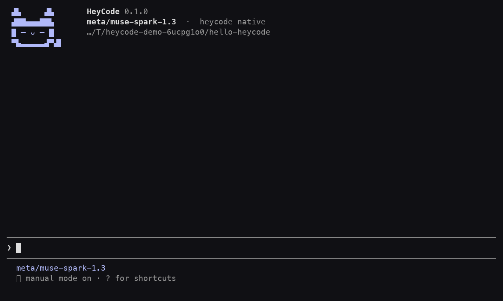
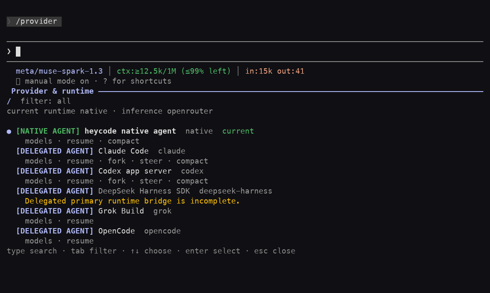
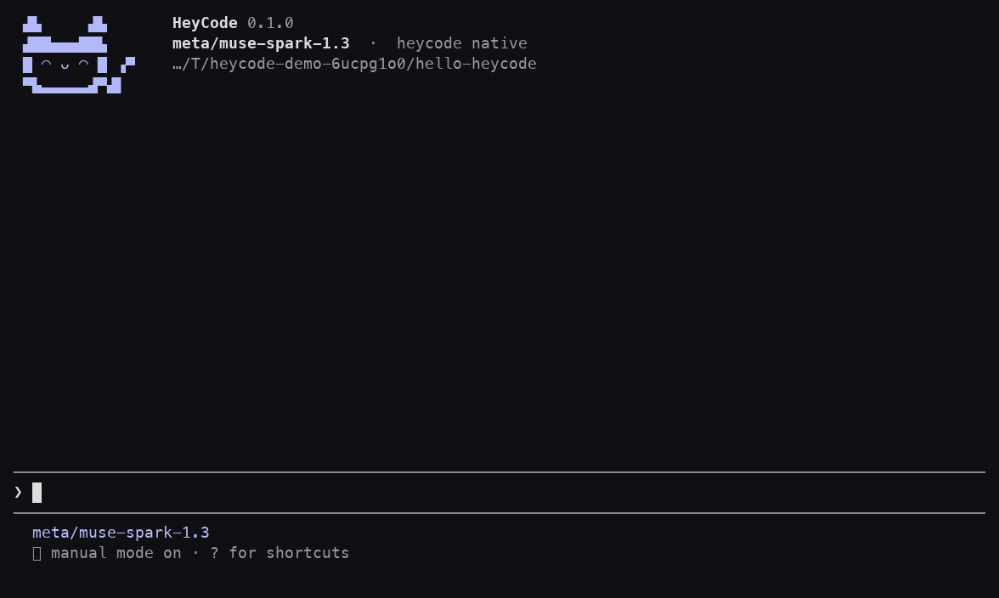

<p align="center">
  
</p>
<h1 align="center">HeyCode</h1>
<p align="center">A coding companion for your terminal.</p>
<p align="center">
  <a href="https://github.com/Naresh084/heycode/releases"></a>
  <a href="LICENSE"></a>
  <a href="https://github.com/Naresh084/heycode/actions/workflows/release.yml"></a>
</p>

Ask questions about your project, plan a change, edit files, and run checks—all in one conversation. Bring your own provider, keep your sessions on your computer, and pick up where you left off.



*Recorded from the actual TUI with a live provider, played at approximately 2× speed. The file read requires approval.*

## Install

Download a standalone executable. No Rust toolchain or repository checkout needed.

```sh
curl -fsSL https://raw.githubusercontent.com/Naresh084/heycode/main/install.sh | sh
heycode
```

The installer checks the release's SHA-256 checksum and installs to `~/.local/bin`. If that directory isn't on your `PATH`, add it to your shell configuration. You can also [download a binary directly](https://github.com/Naresh084/heycode/releases).

| Platform | Release executable |
| --- | --- |
| macOS · Apple Silicon | `heycode-macos-aarch64` |
| macOS · Intel | `heycode-macos-x86_64` |
| Linux · x86-64 | `heycode-linux-x86_64` |

Windows and Linux ARM binaries are not currently part of the release distribution. macOS binaries have build provenance but are not Apple notarized.

## Bring the account you already use

Choose a connection in `/provider`, then a model in `/model`.

| How you connect | What you need |
| --- | --- |
| Claude Code runtime | A supported Claude Code CLI, installed and signed in with your account |
| Codex runtime | A supported Codex CLI, installed and signed in with your account |
| OpenCode runtime | A supported OpenCode installation and its configured provider access |
| Model APIs | Your provider's API credentials: OpenAI, Anthropic, Google, OpenRouter, DeepSeek, and more |
| Local or compatible endpoints | A supported OpenAI-compatible endpoint, including LM Studio |

For delegated runtimes, HeyCode uses the installed CLI and its existing login; it does not import subscription tokens. Account eligibility, rate limits, available models, and supported CLI versions still apply. A chat subscription does not automatically provide an API key. See [provider and runtime setup](docs/guides/providers.md) for connection details.



## Make yourself at home

Start `heycode` inside a project. The setup flow helps you choose a provider and model. Type a request, review permissions when prompted, and let HeyCode work alongside you.

```sh
heycode                            # Open the terminal app
heycode -c                         # Continue your last conversation
heycode run "Explain this project" # Ask from the command line
heycode --version                  # Show your installed version
```

- **Your choice of model.** Connect providers including OpenAI, Anthropic, OpenRouter, Google, and compatible local endpoints. Provider access and any usage charges are your own.
- **Work that you can follow.** See tool activity, review changes, and manage background tasks from the terminal.
- **Sessions that stay with you.** Resume conversations and keep local history in `~/.heycode`.
- **Tools that fit your project.** Add MCP servers, skills, and plugins. Keep project configuration in `heycode.toml` and project state in `.heycode/`.
- **A little company.** The terminal cat blinks, watches while work is running, and reacts to greetings and completed tasks. Click it for a short wave, wink, bounce, or purr. Animations can be disabled in appearance settings.



*Click animation captured from the running terminal app.*

## Updates take care of themselves

Installer-managed copies check for a newer stable release in the background when you start `heycode` and hourly while it stays open. A verified download replaces the executable for the **next launch**. Your running conversation keeps going. The previous executable is retained as `heycode.previous` alongside `heycode`.

Use `heycode update --check` to check immediately or `heycode update` to retry an update. Set `HEYCODE_AUTO_UPDATE=0` to opt out. Development builds do not auto-update. See the [release and update policy](docs/releases.md) for verification, rollback, and version guarantees.

## Your data and permissions

HeyCode stores local configuration, credentials, and conversations in `~/.heycode`; `HEYCODE_HOME` can select another absolute path. Project-local configuration is subject to workspace trust. Review permission requests before allowing tools to run.

Messages and relevant context are sent to the provider you choose. Local storage does not mean offline inference. Don't include secrets in prompts or issue attachments. See [security reporting](SECURITY.md).

## Learn more

[Getting started](docs/guides/getting-started.md) · [Providers](docs/guides/providers.md) · [MCP](docs/guides/mcp.md) · [Plugins](docs/guides/plugins.md) · [Contributing](CONTRIBUTING.md)

HeyCode is an early, pre-1.0 project. Issues and focused pull requests are welcome. The source is available under the [MIT license](LICENSE).
