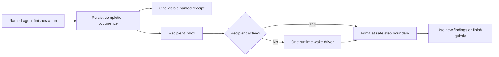

# Agent messaging, completion delivery, and navigation

Date: 2026-09-13. Status: implementation active; progress and verification are tracked in [the implementation tracker](agent-message-delivery-tracker.md). Existing checkout changes from earlier work remain in place.

## Outcome

The parent delegates named work, continues useful independent work, and ends its current turn when it has nothing else to do. Background agents keep running. Messages and results reach their recipients automatically. The UI remains interactive while the parent is idle; it does not require a model-issued inspection or wait operation to make progress.

One completed run produces one small attributed transcript receipt. The full result enters the recipient's context once. The parent uses new findings when useful; the runtime does not manufacture a separate acknowledgment conversation for every delivery. Agent switching retains drafts and keyboard focus and never implicitly opens background-task management.

## Quality gates

Quality takes precedence over elapsed time. Tasks finish on evidence, not on a schedule. No cosmetic change may conceal failed work, and no passing scripted run alone establishes actual-model orchestration quality.

| Gate | What must be true |
| --- | --- |
| Reliable delivery | No lost result, duplicate admission, or notification-generated acknowledgment loop |
| Honest state | Running, completed, recovered tool errors, failed, cancelled, and unavailable remain distinct |
| Usable interaction | One focus owner, preserved drafts, accessible errors, deliberate navigation |
| Reviewable evidence | Reproduction and integrated traces are linked to the tested binary |

## Evidence and comparison boundaries

Reviewed the current local implementation, supplied screenshots/transcript, and current official Claude documentation. Installed Claude reports `2.1.269`. This investigation did not run a live comparative Claude delegation session or inspect its private runtime. Public behavior is a reference; implementation details below are proposed heycode design.

Claude's [subagent documentation](https://code.claude.com/docs/en/sub-agents#run-subagents-in-foreground-or-background) describes concurrent background execution and completion notifications. Its [resume documentation](https://code.claude.com/docs/en/sub-agents#resume-subagents) supports addressing `SendMessage` by ID or name, resuming retained conversations, and distinguishes user-stopped agents from automatically resumable ones. Named messaging does not require agent teams. Context isolation, fork inheritance, and per-agent model context are documented separately.

The [agent-team documentation](https://code.claude.com/docs/en/agent-teams) describes automatic message delivery and idle notifications. It is a distinct, experimental coordination surface. Older simplified comparisons must not override the updated subagent page. The [official changelog](https://github.com/anthropics/claude-code/blob/main/CHANGELOG.md) records fixes for completion routing, resumed-agent status, and notifications; therefore parity must name the tested build.

We will retain the user's chosen UI rules even where Claude differs: left-aligned agent rows, colored hollow rings unless selected, elapsed time at the right, and completed agents removed from the ordinary active strip while remaining inspectable in history.

## Baseline gaps found before implementation

| Gap | Current source evidence | Consequence |
| --- | --- | --- |
| Result has two model-visible paths | `heycode-agent/src/subagent.rs`: list/wait return full task snapshots, including output; background spawn uses `InboxDelivery::FollowUp` | Parent can summarize a result from inspection, then receive it again through the inbox |
| Completions wait for separate turns | `heycode-agent/src/agent.rs`: one FollowUp opens each turn | Five finished children can produce five additional acknowledgment turns |
| Changing the delivery enum alone is insufficient | `heycode-agent/src/native_runtime.rs`: pending input uses the next-turn-only sender | A Steer-based design needs exact input admission across both queues and race handling |
| Agent identity is lost in completion transport | `heycode-agent/src/jobs.rs`: `[job …]` envelope and `InboxSource::Job`; `heycode-session/src/inbox.rs` persists only job ID for this source | Model and UI talk about job numbers; historical names depend on a live registry |
| Messaging is shaped as another job | `heycode-agent/src/subagent_provider.rs::queue_message`: starts a coordinator job and settles it back to sender | Delivery acknowledgment can itself become another completion message |
| Messaging authority is child-control authority | `task_record_for` only admits records owned by the caller | Parent and sibling messaging cannot safely be added by loosening all control permissions |
| Routine tool suppression leaks | `heycode-tui/src/transcript.rs::quiet_orchestration`: approval metadata, expanded groups, and nested failure states bypass quiet rendering | Approved inspection/wait calls and unrelated failed-child snapshots surface as tool cards |
| Completion presentation depends on mutable state | `app/task_navigation.rs::refresh_tasks`: re-derives historical completion labels from current job/status | Resume, archive, or registry loss can expose an old raw job card again |
| UI completion timing depends on model admission | `app.rs` projects the operational input when it becomes a UserMessage | Completion receipt can lag settlement; admission and presentation identities are not explicit |
| Keyboard and mouse return disagree | `app/task_navigation.rs`: Enter-on-main calls `return_from_task`, Detail becomes List; mouse main closes tasks | Switching back opens background management unexpectedly |
| Refresh can steal navigation focus | `refresh_tasks`: target removal or empty inventory clears strip focus | Completion/reorder/failure can move the user back to the composer |
| Successful agents become sticky red rows | `task_console.rs::active_child` includes settled children with any historical tool error; `task_render.rs` maps such successful rows to Failed for ring color | A recovered tool failure can masquerade as a failed run and remain indefinitely in the active count |
| Real errors can be filtered out of child output | `task_observation.rs` stores provider errors as Status("Error: …"); `task_render.rs` admits status text only when it contains "fail" or "interrupt" | Rate-limit, authentication, and network errors can be retained but invisible |
| Authoritative error fallback is bypassed | `task_source.rs` returns observed output when an observer exists, bypassing final `TaskSnapshot.output`; compact inspector omits non-tool provider errors | Opening the child or inspector can fail to reveal the terminal error |
| Two apparent cursors | `render.rs::draw_input` paints the editor caret while the strip owns keys | The screen looks focused on the input despite agent navigation |

The source supports the duplicate-delivery mechanism. The supplied live run has not been matched to an immutable binary/session event trace, so exact occurrence counts and the specific quiet-render bypass in that run remain reproduction tasks.

## Runtime contract



### Stable identity and provenance

Keep separate `agent_id` (conversation), `run_id` (one invocation/resume), `message_id` (one delivered message), and `completion_id` (one terminal result). Persist sender/recipient identities, event-time display name, ordering/causation, outcome, and retained result reference. Names are human-facing aliases; routing uses stable IDs. Resolve duplicate or reused names explicitly rather than silently changing recipients.

Agent messages use the ordinary conversation admission mechanism with machine-authenticated agent provenance. They do not become human-authored instructions or acquire the user's permission authority. The model sees the sender and message purpose. Normal UI shows the agent's name; raw IDs remain in diagnostics.

### One result-delivery path

Settlement persists a named completion occurrence and schedules delivery. UI observation produces a receipt immediately after authoritative settlement; context admission marks that same occurrence consumed. Neither observation nor replay creates another result.

Use durable retry with idempotent admission and projection. Do not claim universal exactly-once execution: provider calls, process termination, and storage failures can have uncertain outcomes. Persist enough identity to recover pending delivery without rerunning completed work or duplicating its visible receipt.

Routine roster/status observations contain metadata, not full completion output. Explicit result inspection remains available for human requests or recovery and participates in the same delivery ledger if its content enters the model context. Never mark a result consumed merely because a human opened its transcript.

### Scheduling and batching

For a busy recipient, admit eligible agent messages at the next safe model step. Do not interrupt a running tool or discard an active provider stream just to announce completion. For an idle recipient, one scheduler wakes it to consume the pending batch. Root, nested, app-server, and headless native recipients need one runtime-owned wake driver rather than competing TUI and registry drivers. Native child `run_mail` must select wakeable inputs from both queues. Preserve budget-demoted non-waking Inject messages; the driver must not resurrect them. The turn gate rechecks exact IDs so a message consumed during the wake race cannot cause an empty extra provider request.

Batch ready agent events at admission boundaries without waiting for every child. Preserve individual provenance and causal order. Do not merge, reorder, or consume human messages using agent-event batching. Notifications that arrive during a stream are admitted at the next safe opportunity; another substantive turn may be necessary if the stream was already ending.

Status-only receipts and delivery acknowledgments do not invoke the model. Useful agent messages and new completion results can. Model guidance permits ending a turn silently when no user-facing update is useful; use a typed no-output completion path if the provider needs one. Do not hide generated text with an acknowledgment regex.

### Durable failure windows

Settlement currently spans inbox append, flush, job commit/persistence, and wake publication. Fault injection must cover every boundary. A stable occurrence/outbox record plus reconciliation must recover a published-but-uncommitted or committed-but-unannounced result. Deduplication includes consumed and cancelled occurrences, not only pending input. Preserve existing pending FollowUp records on upgrade: re-inserting their already-used IDs into another queue is rejected by current inbox rules, so any migration requires an explicit compatible operation.

### Messaging and control

Expose a small ordinary model surface: spawn a named agent and send an asynchronous message. Supply a compact authorized roster plus changes so listing is not required to discover recipients. Default send returns an admission receipt promptly; it does not synchronously wait for the recipient's answer.

Support parent-to-child, child-to-parent, and authorized same-session sibling messaging. Maintain separate message, inspect, interrupt, archive, and restore authority. A child may send a finding to its parent without gaining permission to cancel the parent or access unrelated sessions.

A running recipient queues messages; an idle resumable recipient wakes with retained context. One-shot, failed, archived, user-stopped, and unavailable-runtime recipients have explicit behavior and typed errors. User stop prevents automatic resurrection until the user resumes it. Sending a message never recursively creates a message-completed acknowledgment loop.

Remove list/wait from the default model orchestration schema once event delivery is proven. Keep explicit human inspection, diagnostics, and compatibility handlers for existing calls. Audit progressive tool discovery and code-mode aliases so the old polling surface is not silently reintroduced. Cancellation remains an explicit control operation with requested and settled states.

## Interaction contract

Example normal transcript:

```text
○ Architecture completed
○ Providers completed
○ Tools and execution completed

<parent's useful synthesis or next action>
```

Completion rings are green and hollow. Failed and cancelled runs have distinct text and color; cancellation request is not cancellation settlement. Clicking a receipt opens that retained run. No raw output or transport envelope is printed by default. Explicit detailed history preserves exact arguments, result, provenance, and errors.

Example active strip:

```text
● main                                  3s
○ Architecture                         18s
○ Providers                            12s
```

Ring fill means the active conversation only. Status controls ring color. Keyboard focus uses a separate underline or highlight and never fills an inactive conversation. Timer measures the current run and freezes at settlement; returning idle main does not keep a Working spinner alive.

Separate active conversation, focused navigation row, and panel visibility. Refresh preserves the focused stable key through reorder and timer changes. If the row disappears, select the nearest surviving row; when all children settle, retain main as the navigation target until the user exits. Inventory-read failure preserves the last known rows with an unavailable state rather than presenting a false empty inventory. A selected completed transcript stays readable.

Keyboard and mouse activation share one conversation-switch action. Returning to main restores its draft/caret/scroll and the normal collapsed footer. History management opens only on an explicit action; returning from history detail returns to that history origin. Hide the composer caret while another surface owns focus. Screen readers announce the focused agent, state, and navigation actions.

## Failure experience

The latest screenshot adds a required acceptance case. A red ring alone gives no diagnosis, and a historical tool-error counter does not establish that the agent failed. A frozen 45-second timer can correctly represent final elapsed time; the defect is ambiguous state and inaccessible evidence, not the frozen timer itself.

- **Completed after recovery:** show completed; retain recoverable tool errors in that run's details. Do not turn the ring red or keep the agent active because its cumulative error count is nonzero.
- **Actual failed run:** immediately show `○ Tools and execution failed — <short actual reason>` with a red hollow ring and an Enter/click action. Persist stage, error category/code, safe readable message, run identity, partial result, and relevant tool/provider diagnostics. Never invent the reason from a screenshot or a color.
- **Error details:** opening the receipt lands on the failure and the relevant log location, even if the child never produced an assistant message. If diagnostics are missing, state that plainly and provide the retained log location; do not show an empty successful transcript.
- **Active versus attention:** failed/completed/cancelled runs leave the active strip and running count. Preserve unread failures in a compact `1 issue` affordance and the transcript/history until reviewed or dismissed. Dismissal clears attention, not evidence. An already-open failed detail view remains readable.
- **Retry:** offer retry only when the runtime supports it; create a distinct new run, retain the previous error, and consider partial side effects before automatically repeating work. Never silently restart user-cancelled work.
- **Consistency:** run status, ring, active count, issue count, timer, accessibility output, and parent completion summary must all agree. A recovered tool error is neither a terminal failure nor unfinished work.

## Implementation tasks

Task-level implementation and verification status is maintained in the linked tracker. Suggested owners are responsibilities, not separate worktrees.

| Task | Responsibility | Priority | Completion gate |
| --- | --- | --- | --- |
| AM01 | Reproduce and trace | P0 | Each reported symptom has observable evidence |
| AM02 | Identity and durable provenance | P0 | Retry/replay cannot create another occurrence |
| AM03 | Automatic scheduling | P0 | Busy and idle recipients receive messages without polling |
| AM04 | Named messaging | P0 | Correct recipient, preserved context, no receipt loops |
| AM05 | Model tool surface and behavior | P0 | No routine inspect/wait workflow or duplicate result path |
| AM06 | Completion/message presentation | P0 | One named receipt and readable retained result |
| AM07 | Navigation and focus | P0 | Refresh cannot steal focus; main restores normally |
| AM11 | Failure evidence and recovery UI | P0 | No unexplained red ring or settled active count |
| AM08 | Lifecycle/permission/resource integration | P0 | Honest state through stop, questions, and provider boundaries |
| AM12 | Structured questions and prompt guidance | P0 | One/many questions with single/multiple choice and custom answers |
| AM09 | Integrated terminal acceptance | Release gate | Traces and interaction tests satisfy the whole contract |
| AM10 | Review and runnable build | Release gate | Tested artifact and limitations are explicitly identified |

AM11 was added for the user's later failure screenshot; IDs remain stable.

### AM01 — Capture the failing behavior

- [ ] Pin the heycode binary hash, source revision/dirty patch, terminal size, theme, provider, prompt, and tool schema.
- [ ] Reproduce five children finishing before and after parent synthesis, including inspection-before-inbox delivery.
- [ ] Record settlement, inbox append/admission, wake, provider call, and rendered receipt by identity.
- [ ] Reproduce Down with nonempty draft while refresh/settlement happens, then actual keyboard Enter on main.

Accept: failing assertions explain each reported symptom; distinguish source-confirmed mechanisms from exact live-run reproduction. Owner: integration. Dependencies: none.

### AM02 — Persist agent/run/message/completion provenance

- [ ] Extend session/core events and validated inbox sources with stable agent occurrence metadata.
- [ ] Store event-time names and typed completed/failed/cancelled/partial outcomes.
- [ ] Define additive schema migration, old-event decoding, fork/resume projection, and result references.
- [ ] Make settlement retry and consumption idempotent across crash boundaries.

Accept: two runs of one agent create two receipts; a retry of either creates none extra; restart retains the name. Owner: session/runtime. Dependencies: AM01.

### AM03 — Implement automatic recipient scheduling

- [ ] Route background results through active-step/idle-wake admission.
- [ ] Update native pending-input dispatch and child `run_mail` to consume an exact wakeable ID from either queue.
- [ ] Move automatic wake ownership out of TUI-only dispatch; cover root, nested, headless and app-server paths, preserving non-waking Inject semantics.
- [ ] Coalesce ready agent events and deduplicate wake reservations under the turn gate.
- [ ] Cover user input, active streams/tools, compaction, cancellation, failed append, and restart races.
- [ ] Keep status receipts separate from model-triggering work.

Accept: no polling required, no extra provider call for consumed IDs, one active turn per recipient, no lost human input. Owner: runtime. Dependencies: AM02.

### AM04 — Add named asynchronous messaging

- [ ] Introduce authoritative recipient resolution and a compact authorized roster.
- [ ] Separate messaging permission from descendant control permission.
- [ ] Support parent/child and same-session sibling messages with retained context and bounded queues.
- [ ] Replace job-shaped message acknowledgments with non-recursive delivery receipts.
- [ ] Define stopped, archived, one-shot, partial, renamed, and unsupported-provider behavior.

Accept: messages arrive once at the correct agent; sender cannot impersonate human authority; unrelated sessions remain inaccessible. Owner: subagent runtime. Dependencies: AM02–AM03.

### AM05 — Simplify the tools and parent policy

- [ ] Remove routine list/wait from normal model schemas and progressive discovery; preserve compatibility handlers.
- [ ] Make status metadata-only and explicit model result inspection use the delivery ledger.
- [ ] Update managed delegation guidance and tool descriptions: work independently, then yield; await automatic results.
- [ ] Support useful synthesis and quiet turn endings without artificial acknowledgment prompts.
- [ ] Preserve user-authored core prompt files and existing provider/model choices.

Accept: end-to-end model request traces need no inspect/wait calls or raw job results; no repetitive acknowledgment-only turns from duplicate occurrences. Owner: tools/prompt. Dependencies: AM03–AM04.

### AM06 — Project concise completion and message UI

- [ ] Render one immutable named receipt from settlement, independent of context admission.
- [ ] Link retained results by completion/run identity; avoid live-registry relabeling of old events.
- [ ] Keep successful internal inspection quiet even with approval metadata or a failed child in its snapshot.
- [ ] Separate operation errors and pending decisions from child lifecycle errors; display each through its real source.
- [ ] Keep raw-history disclosure explicit and screen-reader replay non-repetitive.

Accept: exactly one green completion line per successful run, correct non-success lines, no job IDs or accidental tool-card expansion. Owner: transcript/UI. Dependencies: AM02, integrates AM03–AM05.

### AM07 — Repair focus and conversation switching

- [ ] Separate active conversation, navigation target, and browser visibility.
- [ ] Share mouse/keyboard switching and track history/detail entry origin.
- [ ] Reconcile by stable key through tick, reorder, completion, overflow, and transient source failure.
- [ ] Hide composer caret during strip focus and announce navigation accessibly.

Accept: repeated Down stays in the selector; Enter changes conversation deliberately; main returns to normal footer; all drafts and scroll positions survive. Owner: navigation. Dependencies: AM01; can proceed independently of backend changes.

### AM08 — Verify lifecycle, permissions, and resource behavior

- [ ] Audit requested cancellation versus actual settlement, pause/resume, and child-created background process ownership.
- [ ] Ensure parent idle is independent of child activity; completed timers and active counts agree.
- [ ] Route child permission/question prompts with agent identity and correct answer destination.
- [ ] Bound message payloads, queues, concurrency, and repeated automatic wakes; expose actionable failure without silent drops.
- [ ] Preserve isolated child context, inherited tool guards, configured model routing, and explicit workspace-isolation choice.

Accept: user stop wins races, pending decisions remain usable, no orphaned worker or misleading Working indicator. Owner: lifecycle/integration. Dependencies: AM03–AM04, AM07.

### AM11 — Make failure evidence visible and clear settled rows

- [ ] Reproduce completed-with-recovered-tool-error separately from actual run failure and interrupted work.
- [ ] Remove cumulative `tool_errors > 0` as an override for lifecycle status and active membership.
- [ ] Persist terminal error detail independently of streamed assistant/tool output and registry availability.
- [ ] Replace substring-based status filtering with typed error rendering in child conversation, inspector, and accessibility output.
- [ ] Merge the authoritative terminal diagnostic with observed events using identity-based deduplication; do not let observer existence suppress the only error evidence.
- [ ] Add a concise named failure receipt linked directly to the retained diagnostic and partial result.
- [ ] Separate active count from unread issue count; move failed rows out of the active strip without discarding their transcripts.
- [ ] Implement review/dismiss actions and explicit supported retry as a new run; keep settled elapsed time frozen.
- [ ] Cover startup failure before any child transcript, provider error without the words "fail" or "interrupt", error absent from observed events, recovered tool error, cancellation, partial result, missing diagnostic, restart and failed retry.

Accept: no red ring without an accessible explanation, no successful run mislabeled failed, no settled agent counted as running, no issue lost when dismissed. Owner: lifecycle/transcript. Dependencies: AM02, AM06–AM07; integrates AM08.

### AM12 — Structured user questions and prompting

- [ ] Inspect existing required and optional question schemas/UI and reuse a shared validated question/answer contract.
- [ ] Advertise `questions` as a list with stable per-question ID, question text, optional short header, answer type (`single_choice`, `multiple_choice`, `free_text`), and options with labels/descriptions. Accept one question or a bounded batch.
- [ ] Make custom text available for choice questions. Single choice selects one answer; multiple choice toggles several choices with explicit submit; custom text is retained and attributed per question.
- [ ] Validate IDs, option uniqueness, answer count/type, blank input, bounds, and stale question answers. Never treat the highlighted/preselected option, timeout, dismissal, or silence as a submitted answer.
- [ ] Required input pauses dependent work and clearly identifies the requesting agent. Optional input permits independent work. Opening/closing the card preserves the user's composer draft and selected conversation.
- [ ] Ensure the model's managed prompt explicitly directs it to use the question tool whenever necessary user input is missing, offer useful choices, and bundle related questions. Do not ask artificial questions when the task is already clear.
- [ ] Route parent and supported child questions through the same structured contract and preserve exact answer provenance. Unsupported runtimes report capability limits rather than pretending a question was shown.
- [ ] Add source/schema tests and real terminal journeys for single choice, multiple choice, custom answer, multiple questions, dismissal/reopen, required versus optional, and child-owner delivery.

Accept: a model-issued question visibly opens or advertises the real interactive question surface; submitted selections/custom text return to the correct agent once; no raw question IDs/JSON leak into normal chat. Claude reference: [official user-input documentation](https://code.claude.com/docs/en/agent-sdk/user-input). This task is part of the active goal's release gate.

### AM09 — Prove the complete terminal journey

- [ ] Replace the fixture's scripted list/wait dependence with spawn, messages, and automatic delivery.
- [ ] Test five staggered and simultaneous children, busy/idle parent, user interruption, child-to-parent question, sibling handoff, second run, failure, cancellation, and restart.
- [ ] Interleave real key presses with live refresh, typing, selection, and row settlement.
- [ ] Verify 60×24, 110×42, wide terminal, dark/light/NO_COLOR, Unicode labels, and screen-reader output.
- [ ] Retain transport cleanup/backpressure regression coverage for the earlier mouse-escape crash.

Accept: event/request counts plus terminal behavior meet the contract; screenshots alone are insufficient. Owner: integration. Dependencies: AM05–AM08, AM11–AM12.

### AM10 — Review and rebuild

- [ ] Run affected session, agent, tools, TUI, CLI checks and warnings-denied Clippy for modified targets.
- [ ] Inspect the integrated diff and record changed public/schema contracts, compatibility, and unresolved failures.
- [ ] Rebuild `target/debug/heycode`; attach immutable trace/screenshot evidence to the tested hash.
- [ ] Compare the focused interaction against pinned Claude when live comparison is authorized/available; separately identify scripted versus actual-model evidence.

Accept: no task is marked complete from a helper-only test; the final report says exactly which runtime/provider combinations were exercised. Owner: root. Dependencies: AM09.

## Dependency and delivery order

AM01 → AM02 → AM03 → AM04 → AM05. AM06 can develop against AM02's agreed event contract. AM07 can run independently after reproduction. AM11 repairs failure evidence and settled-row retention. AM08 joins runtime, failure, and navigation behavior; AM09 verifies the integrated journey; AM10 produces the runnable artifact.

Runtime delivery and provenance come before removing the operational tools. Otherwise a cleaner transcript could conceal stalled or undelivered work. Shared event/schema changes are coordinated centrally; other owners edit disjoint files. Work remains in the existing checkout. No commit, publish, paid-provider run, or user-session restart is part of this implementation.

## Release acceptance matrix

| Scenario | Required evidence |
| --- | --- |
| Five child results arrive while parent works | Five unique result admissions, five receipts, substantive synthesis with no reread acknowledgment turns |
| Parent has nothing else to do | Parent turn ends; children continue; a new result wakes parent automatically |
| Result arrives during provider stream or long tool | No discarded stream or interrupted tool; result admitted at the next safe boundary |
| Many ready results | Bounded batch admission, preserved per-message identity, no wake storm |
| Result inspected before notification | Same completion ledger prevents a second automatic delivery |
| Duplicate event or restart between append/commit | One durable occurrence and receipt; no rerun of settled work |
| Same agent completes a second run | A new run/completion identity, new timer, one additional receipt |
| Message to parent/sibling or reused name | Correct validated destination; explicit ambiguity/stale-name refusal |
| User cancels or types during completion | User intent and draft preserved; no auto-resurrection or wrong recipient |
| Successful agent recovered from a failed tool | Completed lifecycle/green receipt, no active row or mandatory issue from historical counter alone |
| Actual failure before any assistant output | Named reason visible; receipt opens retained error; zero false running count |
| Review/dismiss/retry a failure | Attention clears deliberately, evidence persists, retry uses a new run and timer |
| Child fails or waits for approval | Named actionable lifecycle/approval UI; no misleading success or polling card |
| Down during reorder/removal/source failure | Stable navigation ownership and one visible caret/focus indicator |
| Return from child to main | Restored parent state, normal footer, no surprise Background panel |
| Single/multiple choice and custom question answers | Correct selection rules, explicit submit, stable question IDs, exact once owner delivery, preserved draft |
| Batched parent/child questions | Each answer mapped to its own question; required work waits, optional work can continue |
| Old replay without new provenance | Compatible, conservative interpretation; human lookalike messages stay human |

## Why earlier checks missed this

Earlier deterministic journeys proved completion delivery, cleaned-up rendering, and eventual idle. Their scripted provider still used inspect/wait and accepted separate per-completion follow-up turns. They did not prove that an actual model could operate using only asynchronous notifications, nor reject results exposed through two paths. Navigation checks used static inventories or direct helper calls and missed real key input interleaved with refresh. This plan changes those acceptance criteria rather than treating prior green tests as proof of the requested experience.
